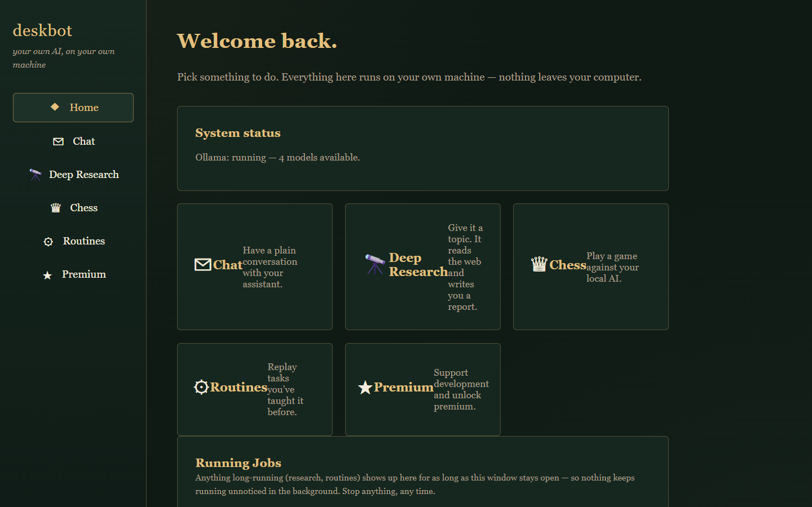
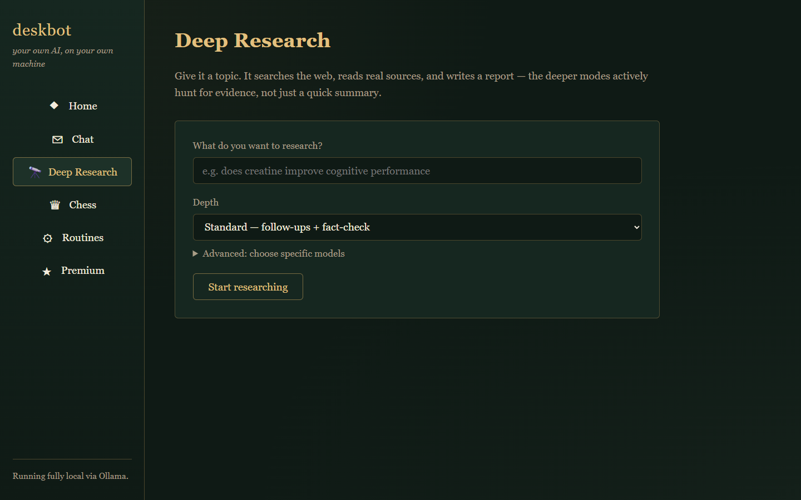
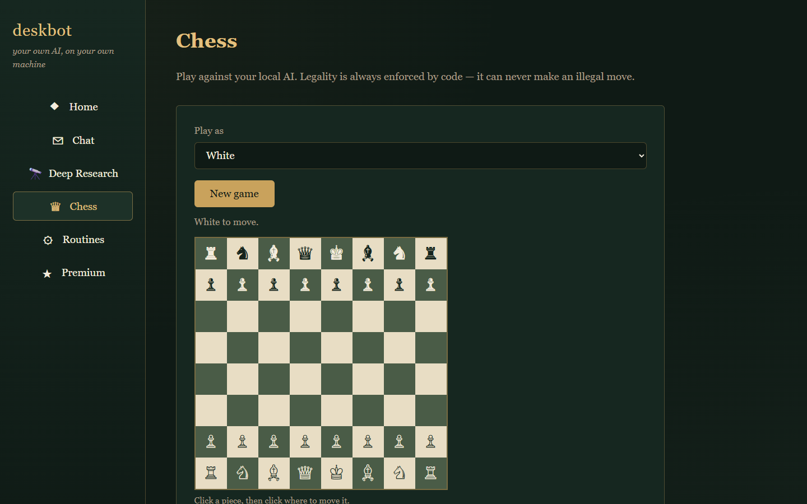
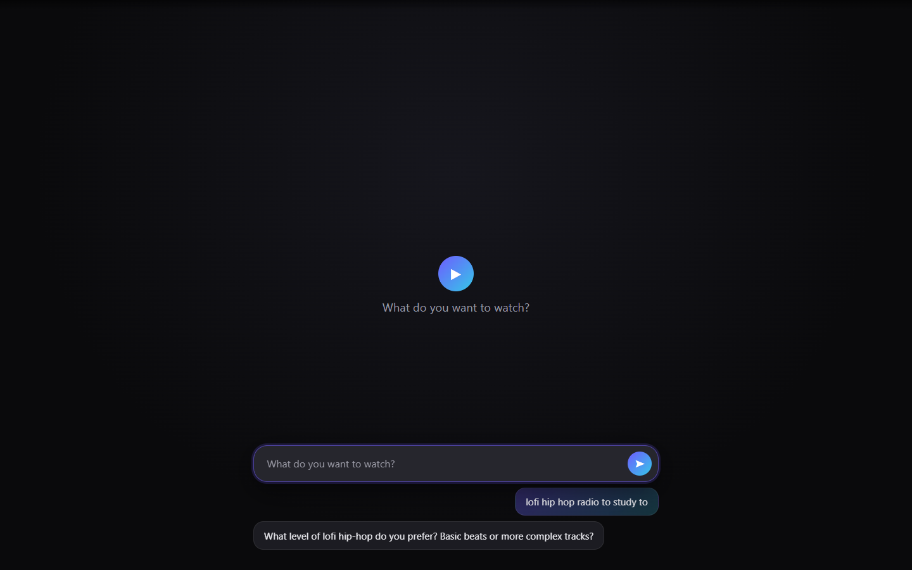

# deskbot — a local Jarvis, running entirely on your own machine

A private AI agent for Windows that runs 100% locally via [Ollama](https://ollama.com)
— no cloud, no API keys, no subscription, nothing you type ever leaves your
computer. It can chat, research a topic like a scientist, run real browser/shell
automation, teach itself routines, play chess, run a distraction-free YouTube
kiosk with zero buttons and zero algorithm, and it has a full web interface
anyone can use — not just people comfortable with a terminal.



**Status: Phase 1 (Core), Phase 2 (Hands), and Phase 3 (Routines) complete,**
plus deep research, chess, a web UI, and a no-button voice-of-command YouTube
kiosk built on top. Phases 4–5 (screen vision & game automation, WhatsApp
customer chat) are not implemented yet — see [Roadmap](#roadmap) below for
what's coming.

## Quick Start (2 minutes, no coding required)

1. Install [Ollama](https://ollama.com) (it'll prompt you to pull a model the
   first time) and [Python 3.11+](https://www.python.org/downloads/) if you
   don't already have them.
2. Download this repo (green **Code → Download ZIP** button above, or
   `git clone`) and unzip it anywhere.
3. Right-click **`install.ps1`** → **Run with PowerShell** (or open a
   terminal in the folder and run
   `powershell -ExecutionPolicy Bypass -File .\install.ps1`). This detects
   your RAM, pulls the right-sized model, and installs everything.
4. Double-click **`Deskbot UI.bat`** — a browser tab opens with the full
   interface: chat, deep research, chess, routines. That's it, no command
   line needed from here on.

Prefer the terminal? `deskbot` for the interactive REPL, `deskbot research
"<topic>"` for deep research, `deskbot chess` to play — see [Usage](#usage)
below for the complete command list.

## What works right now

**Phase 1 — Core:**
- `deskbot` installed as a real command on your PATH, launchable from any
  directory.
- A local LLM brain via Ollama, with the model auto-selected from your RAM
  (8/16/32 GB tiers — see `config.yaml`).
- Personas: named characters with role, tone, greeting style, sample
  phrases, boundaries, humor level, and language mix (multilingual/Hinglish
  personas are supported natively via `language_mix`).
- Persistent memory: conversations are stored in SQLite
  (`~/.deskbot/deskbot.db`) and resumed automatically per persona, plus a
  per-contact notes table the agent will use to remember people (used more
  heavily starting Phase 5).
- Streaming replies, rotating file logs (`~/.deskbot/logs`), and
  `deskbot doctor` for environment diagnostics.

**Phase 2 — Hands:** (only active in the bare `deskbot` REPL and `deskbot do`
— `deskbot chat -p <persona>` stays tool-free by design)
- `run_shell`: runs a PowerShell command, auto-classified **SAFE** (runs
  silently), **CAUTION** (runs, logged at WARNING), or **DESTRUCTIVE** (pauses
  for an explicit y/n in the terminal) from the pattern lists in
  `config.yaml`.
- `open_app`: opens an installed app by common name (`chrome`, `edge`,
  `notepad`, `explorer`, ...) resolved dynamically via the Windows App Paths
  registry, PATH, and a Start Menu shortcut search — no hardcoded install
  paths.
- A Playwright-driven browser layer that reuses your **actual installed**
  Chrome/Edge (via Playwright's `channel=` option, so no extra browser
  download is needed) with a persistent profile under
  `~/.deskbot/browser_profile/`, so logins survive restarts. Optional CDP
  attach to your already-running Chrome (`browser.cdp_attach: true` +
  `--remote-debugging-port`).
  Tools: `browse`, `search`, `click`, `type`, `extract_text`, `screenshot`,
  `fill_form`, `download`. Simultaneously open tabs/windows are capped at
  `browser.max_open_windows` (default 3) — e.g. `target="_blank"` links
  opened while researching don't pile up unbounded windows; extras are
  closed automatically.
- A general tool-calling loop: the model either answers directly or emits
  tool calls, each tool runs with one retry and a structured error fed back
  on failure so the model can self-correct, capped at 8 steps, with stuck
  detection if the same tool+arguments get called repeatedly with no
  progress.
- **Instant quick actions** (`deskbot/resolver.py`): obvious commands —
  "open youtube", "launch notepad" — are matched against a config-driven
  alias table and executed directly through the same `browse`/`open_app`
  tools the model would use, with **zero LLM calls**. Only genuinely
  ambiguous or unfamiliar phrasing falls through to the full tool-calling
  loop, so the common case is instant instead of paying a model round trip
  for something that doesn't need one.

**Phase 3 — Routines:**
- `deskbot teach <name>`: describe a task once, deskbot performs it via the
  normal tool-calling loop while recording every successful tool call, then
  interactively lets you turn specific argument values into `{placeholders}`
  so future runs can override them.
- `deskbot run <name> [--param k=v ...]`: replays a taught routine's exact
  tool calls (no LLM involved unless a step fails) with parameter
  substitution.
- `deskbot routines list|edit|delete`: manage saved routines
  (`~/.deskbot/routines/<name>.yaml`).
- `deskbot schedule <name> "<cron>"`: registers a routine with Windows Task
  Scheduler. Supports a common 5-field cron subset — daily (`M H * * *`),
  weekly (`M H * * D`), every N minutes (`*/N * * * *`), every N hours
  (`0 */N * * *`) — and raises a clear error instead of silently
  misinterpreting anything outside that subset.
- Resilience: each step already gets a timeout + one retry (from the Phase 2
  tool layer). If a step still fails, deskbot asks the model to re-plan just
  that one step given the error, retries the re-planned call once, and
  aborts with a readable log if that also fails — it never hangs or loops
  forever. DESTRUCTIVE shell commands auto-decline (rather than hang
  forever) when a routine runs non-interactively, e.g. via Task Scheduler.

**Watch Kiosk — a YouTube player with no algorithm and no buttons:**
- `deskbot watch` opens a dedicated, chromeless window: no search bar, no
  homepage, no recommended-videos rail — you say what you want, it finds a
  real video and plays it. See [Watch Kiosk](#watch-kiosk) below for the
  full design.
- Every control — volume, mute, pause, splitting the screen into up to
  four videos, resizing a pane — is a typed sentence, not a click. There is
  no button, slider, or keyboard shortcut anywhere in the app.

## Install

**Windows (primary):**

```powershell
powershell -ExecutionPolicy Bypass -File .\install.ps1
```

This checks Python 3.11+, installs Ollama if missing (via `winget`), detects
your RAM and pulls the matching tiered models, installs the `deskbot`
package, and puts `deskbot` on your PATH. Open a **new terminal** afterwards
so the PATH change takes effect.

**Linux/macOS (secondary):**

```bash
./install.sh
```

Skip the (slow) model pull on either platform during dev iteration:

```powershell
powershell -File .\install.ps1 -SkipModelPull
```
```bash
SKIP_MODEL_PULL=1 ./install.sh
```

## Usage

```bash
# Interactive agent REPL — tools enabled (run_shell, open_app, browser)
deskbot

# Pure persona conversation, no tools, remembers you across runs
deskbot chat -p friend

# One-shot task, prints the result, exits — tools enabled
deskbot do "open edge, search for insulated bottle vacuum physics, open the two best results, summarize both"

# Deep, multi-round research — NOT a single search. See "Deep research architecture" below.
deskbot research "wifi vs ethernet speed"
# Run from a real terminal with no flags and you'll get an interactive
# arrow-key menu (Quick/Standard/Deep/Relentless/Scientist/Authority/Custom) and,
# optionally, which locally pulled Ollama model(s) to use for this one run.
# Press Enter on any question to keep the sensible default. Non-interactive
# callers (scripts, `deskbot run`, scheduled tasks) skip the menu automatically.
# Also runnable by a non-technical user: double-click "Deep Research.bat" (also
# copied to the Desktop), type a topic when prompted, and the report opens itself.

# Skip the menu and control everything via flags instead:
deskbot research "wifi vs ethernet speed" --mode deep
deskbot research "wifi vs ethernet speed" --no-menu --quick-model qwen2.5:1.5b-instruct-q4_K_M --synthesis-model qwen2.5:14b-instruct-q4_K_M

# Relentless: extracts factors, digs into every relationship between them,
# and never stops on its own — press Ctrl+C whenever you're satisfied.
deskbot research "what actually determines a country's inflation rate" --mode relentless

# Scientist: same as Relentless, but forms a falsifiable hypothesis first,
# actively hunts for evidence that would DISPROVE each relationship (not
# just confirm it), and rates confidence by source credibility.
deskbot research "does creatine improve cognitive performance" --mode scientist

# Authority: invents a plausible domain-expert persona for the topic and
# writes the report in that voice — LaTeX equations for anything
# quantitative, (Author, Year, Journal, Vol:Pages)-style citations — then
# appends a large taxonomy of hundreds of specific, testable research
# questions (each with a hypothesis and a suggested method), organized into
# primary domains and subtopics. The academic-review equivalent of Deep mode.
deskbot research "fundamental physics of loudspeaker construction" --mode authority

# Create a new persona interactively
deskbot persona create

# List known personas
deskbot persona list

# Teach a routine (describe it once, deskbot performs it and remembers how)
deskbot teach open-notepad
# > Describe the task: Use the open_app tool to open notepad.

# Replay a taught routine, optionally overriding parameters
deskbot run open-notepad
deskbot run search-and-summarize --param query="new search term"

# Manage routines
deskbot routines list
deskbot routines edit open-notepad
deskbot routines delete open-notepad

# Schedule a routine with Windows Task Scheduler (daily at 9:30am)
deskbot schedule open-notepad "30 9 * * *"

# Play chess against the local model, right in the terminal
deskbot chess
deskbot chess --color black

# Launch the local web interface (chat, research, chess, routines, premium)
deskbot ui
deskbot ui --port 9000 --no-browser

# Open the distraction-free YouTube kiosk — say what you want to watch,
# then control everything (volume, pause, split screen, resize) by typing.
# See "Watch Kiosk" below.
deskbot watch
deskbot watch --port 9001

# Diagnose your environment (Ollama up? model pulled? Playwright/browser ok?)
deskbot doctor
```

## Web UI

`deskbot ui` (or double-click **`Deskbot UI.bat`** / the Desktop shortcut)
starts a local web server on `127.0.0.1` and opens it in your browser — a
proper interface over the same features the CLI has, designed to be usable
by someone who's never touched a terminal, while staying dense enough for a
developer to actually get work done in.

- **Chat** — plain persona conversation (same `Agent.converse`/memory the
  CLI's `deskbot chat` uses, so history is shared and persists).
- **Deep Research** — pick a topic and a depth (Quick/Standard/Deep/
  Relentless/Scientist/Authority), watch it work in a live console panel, read the
  finished report, or hit Stop at any point — the Relentless/Scientist modes
  don't stop on their own by design, so this is the actual Ctrl+C for them.
  An "Advanced" section lets you pick specific planning/writing models.

  
- **Chess** — a real clickable board (legality is still 100% code-driven,
  same as the terminal version — see `chess_game.py`).

  
- **Routines** — list and run anything already taught via `deskbot teach`,
  with live output.
- **Premium** — see below.

Research and routine runs go through the same `deskbot research`/
`deskbot run` subcommands as real subprocesses (streamed to the browser over
SSE), not reimplementations — stopping one from the browser sends a real
`CTRL_BREAK_EVENT`/`SIGINT` to that process, so it hits the exact same
graceful-shutdown code path as pressing Ctrl+C in a terminal. Chat and chess
run in-process directly against `Agent`/`chess_game.py` since they're fast,
turn-based interactions with no need for subprocess isolation.

**Design:** a deliberately restrained "old money" palette (deep forest
green, aged gold, ivory, serif type) instead of a typical flat SaaS-app
look, no external fonts/CDNs (works fully offline like the rest of deskbot),
and a large base font size + big tap targets so it's comfortable for someone
who isn't especially computer-literate, not just someone who wants dense
developer tooling.

### Premium

deskbot itself is free and stays fully local — there's no subscription
required to use any of it. The Premium panel exists for anyone who wants to
support development directly: it shows a wallet address (and QR code) to
send crypto to, and an unlock-code field.

Being honest about what this actually is: deskbot has no backend server, so
there is no way for the app to automatically detect that a payment
happened — that confirmation is manual (you check the wallet, then email a
code to whoever paid). What *is* real is the code itself: unlock codes are
Ed25519 signatures over the buyer's email (`deskbot/webui/licensing.py`
ships only the **public** key), so even though this is open-source code,
nobody can mint a valid code without the matching **private** key — the
same trust model real commercial license keys use. To issue a code after
confirming a payment yourself:

```bash
python -m deskbot.webui.generate_license <email> <base64-private-key>
```

The private key is never committed to this repo (see `.gitignore`) — keep
it somewhere safe, not in the project folder.

### A note on tool-calling model quality

Not every model that Ollama tags `"capabilities": ["tools"]` actually uses
the structured tool-calling wire format reliably — some just echo JSON as
plain text instead of populating a real `tool_calls` field, which the agent
loop then treats as a (wrong) final answer instead of running anything. The
**Qwen2.5-instruct family** (the default for every RAM tier in
`config.yaml`) has a correct tool-calling chat template in Ollama and is what
this was built and tested against. If you swap in a different model and
`run_shell`/`open_app`/browser tools stop firing, check that the model
actually supports Ollama-style tool calling before assuming deskbot is
broken.

### Deep research architecture

`deskbot research "<topic>"` is deliberately **not** "ask the model to search
and summarize" — that was tried first and, in real testing, produced a single
flat search that missed obvious follow-up angles and sometimes covered barely
anything. What it does instead:

1. **Round 1 (broad):** deskbot searches the topic itself, code-driven (not
   left to the model to decide when to search/click) — it scrapes the real
   result links straight off the search results page (`list_search_results`),
   dedupes by domain, skips a low-quality-domain blocklist
   (`research.blocked_domains` — content farms, redirect/share pages), and
   reads each page's actual text (`extract_text`/`browse`), skipping pages
   that fail to load or come back empty. If Google returns nothing usable
   for a query (blocked/empty — common for automated traffic), it
   automatically retries the same query on Bing before giving up on that
   round.
2. **Planned follow-up rounds:** the model reads a sample of round 1's
   findings and proposes specific follow-up questions — the kind a real
   analyst would chase down next (`research.followup_rounds` in config,
   default 3). Each follow-up question gets its own dedicated search-and-read
   pass, excluding domains already covered.
3. **Adaptive "dig until satisfied" rounds:** instead of stopping once the
   planned rounds are done, deskbot keeps asking the model "given everything
   found so far, what important angle is still missing or unclear?" and
   researches whatever it names — repeating until the model reports nothing
   significant is left, or the `research.max_total_rounds` safety cap
   (default 8) / character budget is hit. This is what makes it behave like
   someone who keeps digging until they're actually satisfied, rather than a
   script that always does exactly N searches regardless of the topic.
4. **Section-by-section synthesis (map-reduce):** a single giant "write the
   whole report" call was tried and failed twice in real testing — the model
   let whichever angle appeared last in the (very long) context crowd out
   every earlier one, even with explicit "cover all sections" instructions.
   So each round is synthesized into its own section **independently** (the
   model literally can't lose track of earlier rounds, because it never sees
   them while writing a later one). Independent also means concurrent: every
   section drafts (and fact-checks) at the same time on a small thread pool
   (`research.synthesis_workers`, default 4) instead of one at a time, and
   the report-level passes that don't depend on each other — key findings,
   contradictions, factor analysis — run in parallel too. On a long
   "relentless"/"scientist" run with a dozen-plus angles, that's the
   difference between waiting through a dozen sequential model calls and
   waiting through effectively one.
5. **Self-fact-check pass** (`research.verify_sections`, default on): each
   drafted section is re-checked against its own source excerpts and
   corrected if it contains a claim the sources don't actually support —
   catches small-model hallucination before it reaches the report. One extra
   local call per section; disable for a faster, unverified report.
6. **Contradictions & Open Questions:** a dedicated pass reads across every
   written section and explicitly calls out disagreements between sources,
   conflicting numbers, or unresolved questions — since section synthesis is
   per-angle, nothing upstream of this step ever compares sections against
   each other.
7. **Report framing:** an introduction plus a bulleted "Key Findings" list
   opens the report; the conclusion is written **last**, after contradictions
   are known, so it can honestly reflect whatever uncertainty was found
   instead of a falsely tidy wrap-up.
8. **Factor/correlation digging** (opt-in — `ResearchOptions.factor_analysis`,
   on for the **Relentless** and **Scientist** presets): once everything
   above finishes, deskbot extracts the concrete factors/variables the topic
   actually depends on (e.g. for "coffee and heart health": caffeine dose,
   genetics, existing conditions, timing) and researches the relationship
   between **every pair** of them — pure combinatorics (`K` factors →
   `K·(K-1)/2` pairs), not left to the model to think to compare things on
   its own — pulling in more factors as it goes. A "Factors & Correlations"
   section in the report maps out what was actually found. This phase only
   ends on genuine exhaustion (two rounds in a row finding nothing new) or
   **you pressing Ctrl+C** — digging is interruptible at any point, and
   Ctrl+C always drops straight to writing up whatever's been gathered
   rather than crashing.
9. **Scientific mode** (opt-in — `ResearchOptions.scientific_mode`, implies
   factor_analysis, on for the **Scientist** preset): the difference between
   "a report" and actually thinking like a scientist.
   - **Hypothesis first:** before digging, `generate_hypothesis` states one
     clear, falsifiable claim worth testing — not just "research the topic."
   - **Actively hunts for disconfirmation:** each factor pair gets **two**
     research questions instead of one (`scientific_relationship_questions`)
     — one seeking evidence that *supports* the relationship, one seeking
     evidence that *contradicts* it. A real scientist tries to falsify their
     own hypothesis rather than only collecting support for it.
   - **Credibility-weighted confidence:** every source is tagged with a
     code-computed credibility tier (`_score_credibility` — `.gov`/`.edu`/
     known journals (PubMed, Nature, NEJM, Cochrane, ...) = high, reputable
     news/health sites = medium, everything else = low; never model-judged,
     for the same reliability reason the domain blocklist is code-driven).
     `synthesize_scientific_assessment` then rates each relationship's
     evidence strength (Strong / Moderate / Weak / Conflicting /
     Insufficient) weighted by that credibility, explicitly flags
     correlation-without-causation, and lists confounding variables — a
     "## Scientific Assessment" section replaces the plain "Factors &
     Correlations" one, and a "## Hypothesis" section opens the report.
10. **Academic/"Authority" mode** (opt-in — `ResearchOptions.academic_mode`,
    on for the **Authority** preset): the review-article treatment.
    - **Invented expert voice:** `generate_expert_persona` invents one
      plausible, field-appropriate domain expert for the topic (name,
      credentials, institutions, decades of experience) with a single small
      model call — the same trick this module uses everywhere: a narrow,
      well-scoped ask the model is actually reliable at, instead of hoping
      every downstream call "just sounds like an expert" unprompted. Every
      section, the key findings, the contradictions pass, and the conclusion
      are then written in that voice.
    - **LaTeX and real citation formatting:** quantitative relationships get
      expressed as LaTeX equations (inline `$F = Bli$` or display
      `$$...$$`), and specific findings get cited as
      `(Author, Year, Journal, Volume:Pages)` — with a
      `[citation needed — proposed: ...]` marker instead of a fabricated
      citation when the model isn't actually certain of one. The
      fact-check pass is told to leave equations and citation markers alone
      unless they contradict a source, since they're standard field
      knowledge and explicit uncertainty flags, not claims the scraped web
      sources need to restate verbatim.
    - **Research taxonomy:** `generate_research_taxonomy` builds a large
      hierarchy of specific, testable research questions — primary domains,
      then subtopics per domain, then leaf items per subtopic, each leaf a
      question + a falsifiable hypothesis + a suggested method — using the
      exact same deterministic-pagination trick as factor/correlation
      digging (ask for a numbered list, parse it, recurse) rather than
      asking a small local model for "hundreds of rigorous research
      questions" in one impossible shot. Every independent branch at every
      level fans out concurrently on the same thread pool section synthesis
      uses (default 10 domains × 6 subtopics × 10 leaves = up to 600
      questions; deskbot reports the actual count achieved rather than
      silently claiming the full total, since small local models don't
      always fill every branch). Appended to the report as "## Research
      Taxonomy".
11. The report is saved as Markdown to your **Desktop, in a `deskbot-research`
    folder** (falls back to `~/.deskbot/research_reports` if the Desktop write
    ever fails) and opened automatically.

**Two-model setup** (`research.quick_model` / `research.deep_model` in
config, or per-run via the menu / `--quick-model` / `--synthesis-model`):
the **planning model** (`quick_model`, falls back to your RAM tier's fast
model) only proposes follow-up questions and decides what's still missing —
short, cheap calls. The **writing model** (`deep_model` if it's actually been
pulled, otherwise falls back to the planning model) drives everything that
produces report prose: every section, the fact-check pass, key findings,
contradictions, and the conclusion — long, organized writing benefits from a
bigger model more than any other step, so it gets used everywhere writing
actually happens.

**Depth presets and the setup menu:** running `deskbot research "<topic>"`
from a real terminal with no flags shows an arrow-key menu (via `questionary`)
— pick **Quick** (single broad search, no follow-ups, no fact-check),
**Standard** (the pipeline above, config defaults), **Deep** (more
sources/rounds, thorough fact-check), **Relentless** (factor/correlation
digging, step 8 above, with round/budget ceilings set so high they're not
the practical limit — Ctrl+C is), **Scientist** (Relentless plus the
hypothesis-driven, disconfirmation-seeking, credibility-weighted mode from
step 9), **Authority** (Deep-level source gathering plus the invented-expert
voice, LaTeX/citation formatting, and research taxonomy from step 10), or
**Custom** (prompts for every setting individually: max sources, character
budgets, follow-up/total round counts, fact-check on/off, adaptive digging
on/off, factor/correlation digging on/off and — if that's on — scientific
mode on/off, and academic/authority mode on/off; saying yes to
factor/correlation digging switches the round/budget fields to the same
effectively-unbounded ceilings Relentless uses). It then offers to pick a
planning model and a writing model from whatever's currently pulled in
Ollama, with tab-autocomplete over them (type `same` for the writing model
to reuse the planning model) — leave either blank to keep config.yaml's
value. If `questionary` is ever unavailable, the menu falls back to a plain
numbered prompt automatically rather than crashing.
Skip the menu entirely with `--mode {quick,standard,deep,relentless,scientist,authority}`,
`--no-menu`, `--quick-model <name>`, or `--synthesis-model <name>`;
non-interactive callers (routines, `deskbot schedule`, anything without a real stdin) skip
the menu automatically so they never hang waiting for input.

**Character budget:** `research.max_corpus_chars` (default 80,000, or the
preset's/`ResearchOptions`' value) caps the total text gathered across every
round combined — split evenly across planned rounds, with unused budget
rolling over to later (including adaptive) rounds, and acting as one of the
two conditions that end the adaptive digging loop.

**Window cap:** simultaneously open tabs are capped at `browser.max_open_windows`
(default 3) regardless of how many rounds run — see the Phase 2 notes above.

**Non-technical usage:** `Deep Research.bat` (project root and copied to your
Desktop) prompts for a topic in plain English and runs everything for you —
no command line knowledge needed.

### Getting blocked by Google?

A plain Playwright-launched Chromium has a few obvious tells — `navigator.webdriver
== true`, the `--enable-automation` flag (and the infobar it pops), and a request
cadence no human produces — and Google's anti-bot system acts on exactly that,
showing a CAPTCHA/"unusual traffic" wall instead of real results. Three layers
of mitigation, in increasing order of effectiveness:

1. **Stealth patches (on by default, `tools/browser.py`):** the automated
   browser launches with `--disable-blink-features=AutomationControlled` and
   `ignore_default_args=["--enable-automation"]`, and every page gets an init
   script that hides `navigator.webdriver` and a couple of other common
   fingerprint checks. Free, automatic, no config needed.
2. **Bing-first, with a human-paced cadence (on by default):** deep research
   tries Bing before Google (`research._SEARCH_ENGINE_FALLBACK_ORDER` —
   Bing is far more tolerant of automated headed browsing) and pauses a
   randomized `browser.min_human_delay_seconds`–`max_human_delay_seconds`
   (default 0.8–2.2s) before every search rather than firing queries
   back-to-back.
3. **Attach to your real browser instead (`browser.cdp_attach`) — the
   actually bulletproof option**, since it isn't an automation-launched
   process at all:
   - Close all Edge windows, then launch it with remote debugging enabled:
     `msedge.exe --remote-debugging-port=9222`
     (or make a desktop shortcut with that flag appended to its Target).
   - Sign in / browse normally in that window so it looks like your regular
     session (it is).
   - In `~/.deskbot/config.yaml`, set `browser.cdp_attach: true` (and
     `browser.cdp_port` if you used a different port).
   - Run `deskbot research` again — it now drives that real window instead
     of launching its own.

If you're still getting walled after all three, the topic's queries may just
be broad/generic enough to look automated regardless — try a `--mode quick`
run first to confirm the pipeline itself is healthy, then dial depth back up.

### Chess

`deskbot chess` (optionally `--color black`) plays a full game against the
local model right in the terminal, in plain ASCII (uppercase = White,
lowercase = Black, `.` = empty — no Unicode glyphs, since plain `cmd.exe`'s
default codepage can't encode those). Type moves in standard algebraic
notation (`e4`, `Nf3`, `O-O`); `moves` lists every legal move for the current
position, `resign`/`quit` ends the game.

Same "don't trust a small model with something it's unreliable at"
philosophy as deep research: **move legality is entirely code-driven** via
the `chess` library, not the model. Asked to freely generate a move, small
local models regularly hallucinate illegal ones — so instead of asking it to
invent a move, `deskbot` shows it the *exact list* of currently-legal moves
and tells it to pick one (skipped entirely when only one legal move exists —
e.g. a forced king move out of check). If it still returns something not on
the list even after one retry with a nudge, a random legal move is played
instead, so a flaky model can never stall the game — worst case it plays
weaker chess, never an invalid one. Set `chess.model` in config to use a
specific model (defaults to your RAM tier's model); a bigger model will
generally play stronger, more sensible chess.

### Watch Kiosk

`deskbot watch` opens a second, dedicated, chromeless window (no address
bar, no tabs — the closest thing to a native app Chromium supports without
an Electron/Tauri shell) with exactly two things on screen: a video area and
a floating chat composer. No search bar, no homepage, no recommended-videos
rail, no autoplay-into-whatever's-next. You say what you want to watch; it
finds a real video and plays it. Built to answer a specific complaint —
YouTube's own UI is optimized to keep you scrolling, not to get you what you
actually asked for.



**No buttons, anywhere — every control is a typed sentence.** Once a video
is playing, volume, mute, pause, closing a pane, splitting the screen into
up to four videos, and resizing how much of the screen each one gets are
all just things you say — `"turn it up"`, `"mute the lofi one"`,
`"split into three"`, `"make this bigger"`. There is no icon, slider, or
keyboard shortcut anywhere in the app; that's a deliberate constraint, not a
missing feature.

- **Grounded, never hallucinated.** The model doesn't invent a video —
  `tools/youtube.py`'s `search_youtube()` scrapes real results (title,
  channel, video ID) straight off youtube.com, and the model is only ever
  allowed to pick an index from that real, already-fetched list — the exact
  same "code searches, model only picks from what's actually there"
  discipline `deskbot research` uses. It asks up to `watch.max_questions`
  (default 3) clarifying questions first, and only when the answer would
  actually change which video is right.
- **Never shows YouTube's own broken-embed screen.** Official/label music
  videos frequently have embedding disabled — a bare `<iframe>` would show
  YouTube's own "Video unavailable — Watch on YouTube" screen, complete with
  a link straight out of the kiosk and back into the exact algorithm-driven
  browsing this exists to avoid. `watch.js` uses the real YouTube IFrame
  Player API instead of a bare iframe specifically for its `onError`
  callback, and silently retries the next real result already found. You
  just see the "Playing:" line update; the failure never reaches you.
- **A real resizable 1–4 pane video wall.** "Split into three" or "give me
  four videos" rearranges an actual CSS Grid (draggable-style resizing, just
  driven by "make this bigger" instead of a mouse), with each pane running
  its own independent search conversation and its own player instance —
  adding a pane never interrupts what's already playing in another one.
- **Two-tier command routing, because a small local model can't reliably
  choose between eight JSON shapes every time.** Layout changes and short,
  unambiguous commands are resolved by a deterministic parser client-side —
  zero model calls, zero latency, correct regardless of which model you've
  got pulled. Only genuinely ambiguous phrasing (title references like "the
  recipe video", "pause everything") falls through to an LLM classifier
  that's handed every pane's live state and decides intent + target in one
  structured call. This split exists because it was tested against a real
  local model during development and *needed* to exist: the deterministic
  layer alone fixed a case where the classifier's own JSON field name
  collided with wording earlier in its own prompt and reliably corrupted
  its output for exactly one action type — found by testing against the
  real model, not assumed, and fixed by renaming the field and adding a
  regex fast-path in front of it, not by hoping a bigger model would paper
  over it.

See [`deskbot/webui/watch.py`](deskbot/webui/watch.py) for the ask → search
→ play state machine and the command classifier, and
[`watch.js`](deskbot/webui/static/watch.js) for the fast-path/classifier
routing and the resizable multi-pane grid.

### Creating a persona

`deskbot persona create` walks you through: name, role, tone, greeting
style, sample phrases, boundaries, humor level, and language mix. The result
is saved to `~/.deskbot/personas/<name>.yaml` and immediately usable via
`deskbot chat -p <name>`.

## Configuration

Everything lives in one file: `~/.deskbot/config.yaml`, seeded on first run
from `deskbot/defaults/config.yaml` in this repo. Model names, RAM tiers,
safety lists, browser prefs, routines/game-profile directories, and WhatsApp
settings are **all** configured there — never hardcoded in code. Edit the
copy in `~/.deskbot`, not the packaged default.

## Hardware notes

- 7–9B instruct models at Q4 quantization use roughly 6–8 GB RAM.
- A vision-language model (VLM) adds another 2–4 GB when loaded.
- No GPU is assumed; everything here runs on CPU inference via Ollama.
- RAM tiers (auto-detected, override with `models.selected_tier` in config):
  - **8 GB** → small Qwen instruct + moondream (vision)
  - **16 GB** → mid Qwen instruct + Qwen-VL 7B
  - **32 GB+** → large Qwen instruct + Qwen-VL 7B

## Troubleshooting

Run `deskbot doctor` first — it checks, in order: Python version, that
`~/.deskbot` is writable, that the `ollama` CLI is on PATH, that the Ollama
server answers on `http://localhost:11434`, and that the configured text
model is actually pulled.

| Symptom | Likely cause | Fix |
|---|---|---|
| `deskbot: command not found` (new terminal) | PATH not refreshed | Open a new terminal; check `install.ps1` output for the Scripts dir it added |
| `LLM error: Could not reach Ollama` | Ollama server not running | `ollama serve` (or just open the Ollama app), then retry |
| `Model '<name>' not found` | Model not pulled yet | `ollama pull <name>` (see `deskbot doctor` output for the exact name) |
| Persona replies feel generic | Persona file is thin | `deskbot persona create` again with richer sample phrases/boundaries |
| Memory doesn't seem to carry over | Different persona name used | Sessions resume **per persona name** — `chat -p friend` and `chat -p Friend` are different personas |
| A DESTRUCTIVE command never asks for confirmation | Running non-interactively (piped stdin) | The y/n prompt needs a real terminal; don't pipe input into `deskbot` if you expect to approve destructive commands |
| Browser tools error with a channel/launch failure | Chrome/Edge not installed, or wrong `browser.default_engine` | `deskbot doctor` reports which channel it resolved; install the browser or fix the config value |
| Model emits raw JSON as its reply instead of actually running a tool | Model doesn't support Ollama tool-calling properly | See [A note on tool-calling model quality](#a-note-on-tool-calling-model-quality) |
| `deskbot research` only reads 1-2 sources per round | Some result pages failed to load or came back empty (logged as INFO, not an error) | Normal — dead links happen; each round still reads whatever succeeded. Increase `research.max_sources` for more attempts |
| A research report feels short despite the 80,000-char budget | Not every topic has that much unique material across 4 rounds (1 broad + 3 follow-up) | Raise `research.followup_rounds` in config for more angles, or check the saved file's per-round character counts printed during the run |
| More browser windows than expected stay open | `target="_blank"` links spawn new tabs | Capped at `browser.max_open_windows` (default 3) automatically — raise/lower it in config.yaml if needed |
| `deskbot teach` says "no tool calls were recorded" | Model answered conversationally instead of using a tool | Be explicit: "Use the X tool to ..." rather than an open-ended request — small models especially need the nudge |
| `deskbot run` fails with "needs parameter X" | Someone hand-edited the routine YAML and removed a placeholder's default | Add `--param X=<value>` when running, or restore a default under `placeholders:` in the YAML |
| `deskbot schedule` rejects your cron string | Outside the supported 5-field subset | Use one of: `M H * * *`, `M H * * D`, `*/N * * * *`, `0 */N * * *` (see `deskbot schedule --help`) |
| `deskbot watch` commands silently get treated as a search (e.g. "split into 4" tries to play a video called that) | Ollama isn't reachable — the classifier can't tell the difference and falls back to "treat this as a search" | `deskbot doctor`, or just `ollama serve`; layout changes and simple volume/mute/pause commands are resolved without Ollama at all once it's back, everything else needs it reachable |
| A chosen video shows "Video unavailable" for a moment then changes | Normal — that title has embedding disabled (common for official music videos); the kiosk's `onError` handler is retrying the next real result automatically | Nothing to fix — if every candidate fails you'll see a plain error bubble instead |

## Verifying yourself

```powershell
# from the project root, in the venv created by install.ps1 (or your own):
python -m pytest tests -v

# Phase 1 — persona memory (requires Ollama running with a pulled model):
deskbot chat -p friend
# say: "Hi! My name is <you>." then "exit"
deskbot chat -p friend
# say: "What is my name?" — it should recall it from the previous session

# Phase 2 — tools (requires a model with real tool-calling support, e.g. qwen2.5:*-instruct):
deskbot do "open edge, search for insulated bottle vacuum physics, open the two best results, summarize both"

# Phase 3 — routines:
deskbot teach open-notepad
# > Describe the task: Use the open_app tool to open notepad.
deskbot run open-notepad
deskbot routines list

# Deep research — multi-round, code-driven navigation, map-reduce synthesis:
deskbot research "wifi vs ethernet speed"
# Verify for yourself: the console prints each round's search query and which
# pages it actually read; the saved report's "Sources" list shows which round
# each source came from, and every round should get its own section.

# Watch Kiosk — no-button, LLM-command-driven YouTube:
deskbot watch
# Type: "mobile repair video" — it should ask a short clarifying question,
# then play a real video (never an invented one — check the title/channel
# against an actual YouTube search yourself).
# Then, with something playing, try: "turn it up", "mute it", "pause it",
# "split into two", "make this bigger" — every one of those should work
# with no button, slider, or keyboard shortcut anywhere on screen.
python -m pytest tests/test_resolver.py tests/test_watch.py -v
```

## Roadmap

- **Phase 4 — Eyes:** hybrid fast/slow-loop screen vision for
  turn-based/puzzle game automation, plus a general `read_screen()` tool.
- **Phase 5 — WhatsApp:** persona-driven customer replies via the WhatsApp
  Business Cloud API (default) or an opt-in local bridge, both with
  approval-mode-by-default and human-handoff keywords.

Each phase will update this README's capability matrix honestly — no phase
is presented as done until its smoke test passes.

## Project layout

```
deskbot/            the installable Python package
  cli.py             argument parsing, command dispatch
  agent.py           core chat/REPL/one-shot loop + tool-calling loop
  llm.py             Ollama HTTP client (streaming chat + tool-calling round trip)
  memory.py          SQLite sessions/messages/contact notes
  persona.py         persona loading + creation wizard
  config.py          config.yaml loading, RAM-tier resolution
  doctor.py          environment diagnostics
  logging_setup.py   rotating file logs + rich console
  resolver.py        instant quick-action fast path (zero-LLM-call alias resolution)
  watch_kiosk.py      `deskbot watch` — launches the chromeless kiosk window + its backend
  tools/             Phase 2 tool layer
    safety.py          SAFE/CAUTION/DESTRUCTIVE classification
    shell.py           run_shell tool
    apps.py            open_app tool (registry/PATH/Start Menu resolution)
    browser.py         Playwright browser session + browse/search/click/... tools
    youtube.py          grounded YouTube search scraper for the Watch Kiosk
  routines.py        Phase 3 routine model (load/save/list/delete, placeholder substitution)
  teach.py           `deskbot teach` — record a task as a routine
  routine_runner.py  `deskbot run` — replay with retry + LLM re-plan-once
  scheduler.py       `deskbot schedule` — cron subset -> Windows Task Scheduler
  research.py        `deskbot research` — multi-round search/scrape/map-reduce-synthesize pipeline
  chess_game.py      `deskbot chess` — terminal chess vs. the local model (legality is code-driven)
  webui/             `deskbot ui` — local web interface
    server.py          FastAPI app: chat/research/chess/routines/premium/watch routes
    jobs.py            subprocess-based streaming runner for research/routine jobs
    watch.py           Watch Kiosk: ask/search/play state machine + no-button command classifier
    licensing.py       premium unlock-code verification (public key only)
    generate_license.py  developer-only: mints unlock codes (needs the private key)
    static/            index.html, style.css, app.js — no build step, no CDN deps
      watch.html/.css/.js  the Watch Kiosk frontend — resizable grid, no buttons anywhere
  defaults/          packaged defaults copied into ~/.deskbot on first run
tests/               pytest smoke suite (isolated from your real ~/.deskbot)
docs/screenshots/    README images
game_profiles/       (Phase 4) — empty for now
install.ps1          Windows installer (primary)
install.sh           Linux/macOS installer (secondary)
Deep Research.bat    non-technical launcher — prompts for a topic, runs deskbot research
                     (also copied to your Desktop by default)
Deskbot UI.bat       non-technical launcher — starts `deskbot ui` and opens your browser
                     (also copied to your Desktop by default)
```

## License

MIT — see [LICENSE](LICENSE). Use it, fork it, ship your own version of it.
